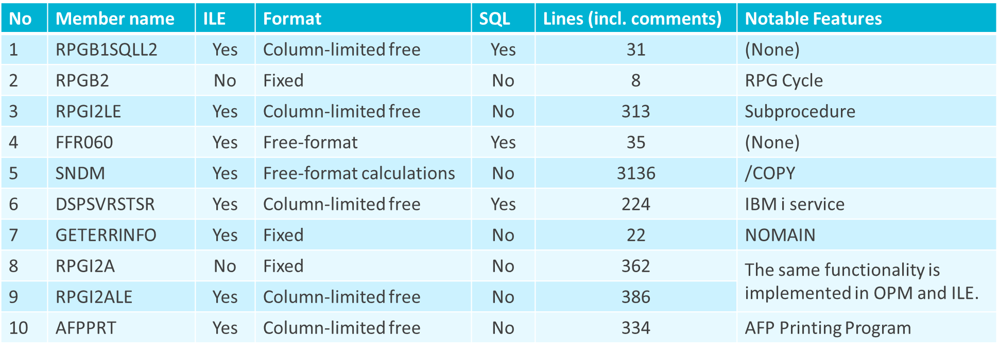

# watsonx_code_assitant_fir_i-Private_Preview-TestCase
Source codes for public preview of watsonx code assistant for i 

<!-- This content will not appear in the rendered Markdown 

|No|Member name|ILE|Format|SQL|Lines (incl. comments)|Notable Features|
|--|-----------|---|------|---|----------------------|----------------|
|1|RPGB1SQLL2|Yes|Column-limited free|Yes|31|(None)|
|2|RPGB2|No|Fixed|No|8|RPG Cycle|
|3|RPGI2LE|Yes|Column-limited free|No|313|Subprocedure|
|4|FFR060|Yes|Free-format|Yes|35|(None)|
|5|SNDM|Yes|Free-format calculations|No|3136|/COPY|
|6|DSPSVRSTSR|Yes|Column-limited free|Yes|224|IBM i service|
|7|GETERRINFO|Yes|Fixed|No|22|NOMAIN|
|8|RPGI2A|No|Fixed|No|362|The same functionality is implemented in OPM and ILE.|
|9|RPGI2ALE|Yes|Column-limited free|No|386||
|10|AFPPRT|Yes|Column-limited free|No|334|AFP Printing Program|

-->
