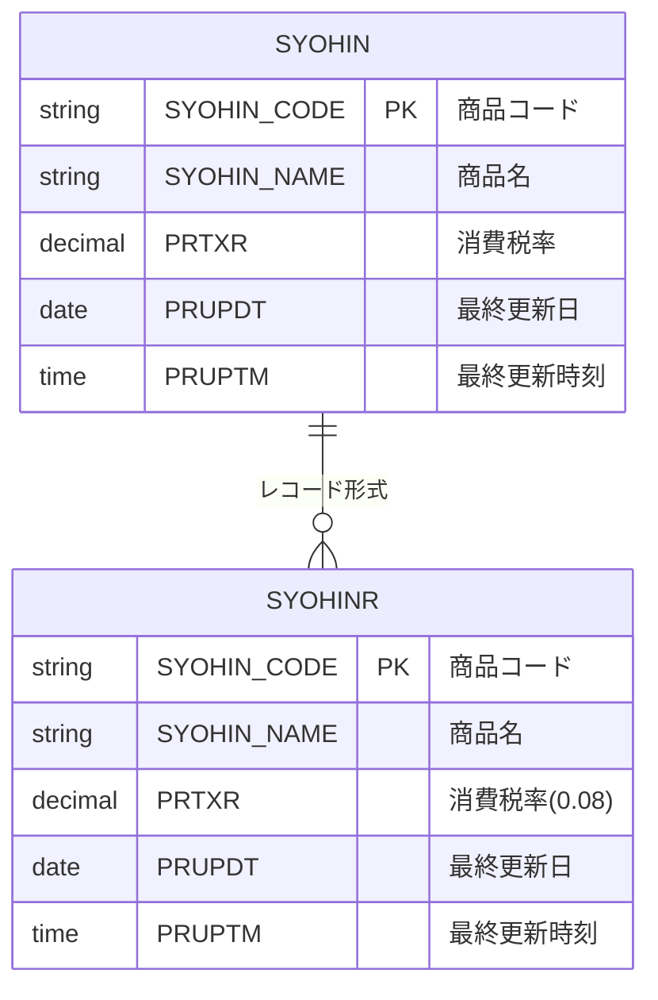
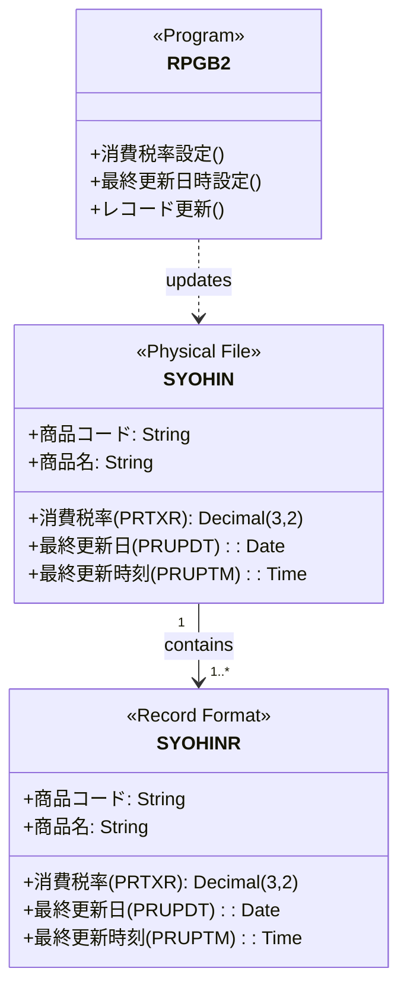
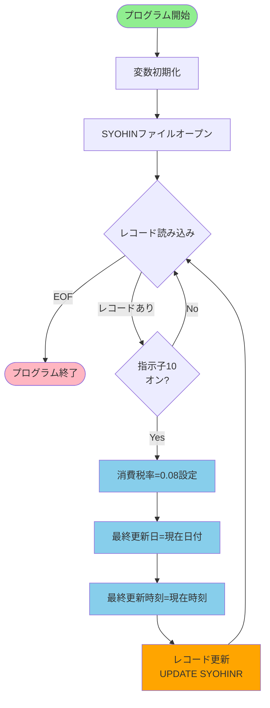
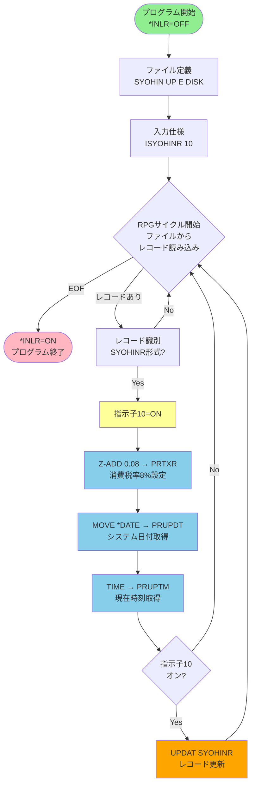
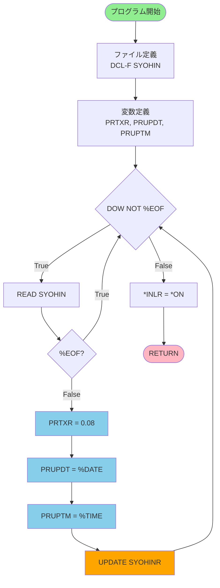
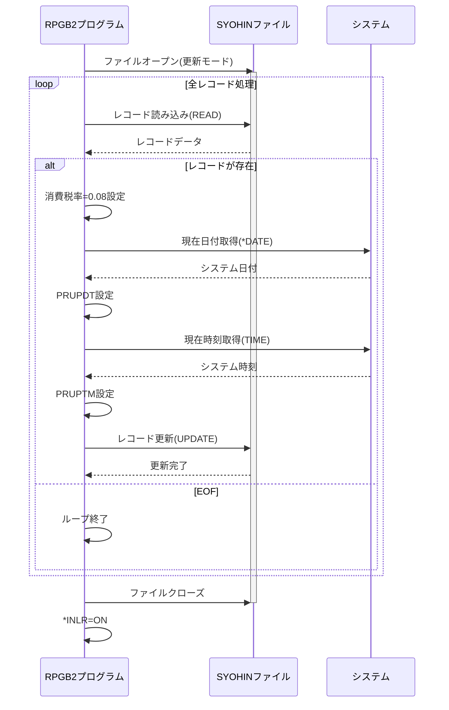
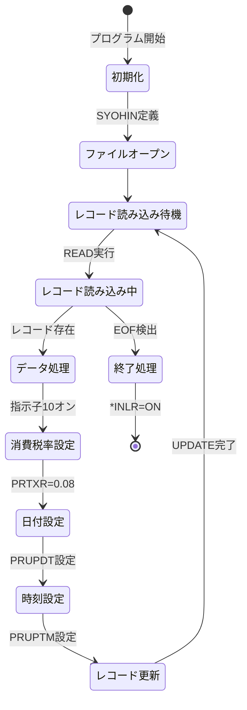
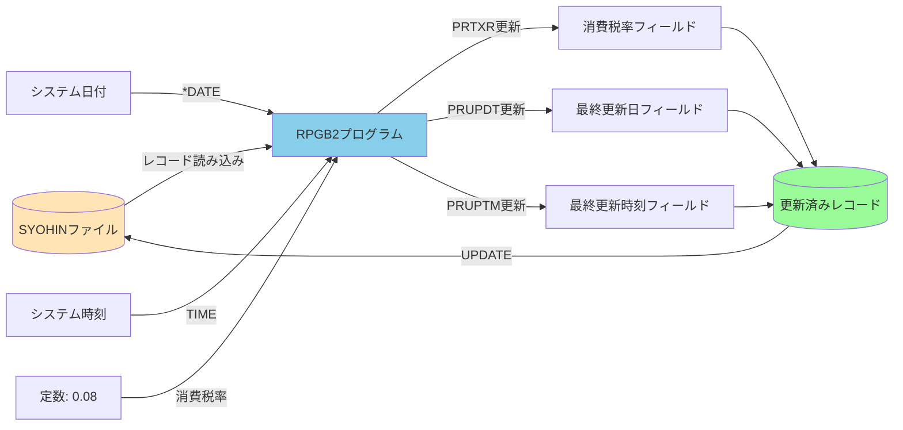
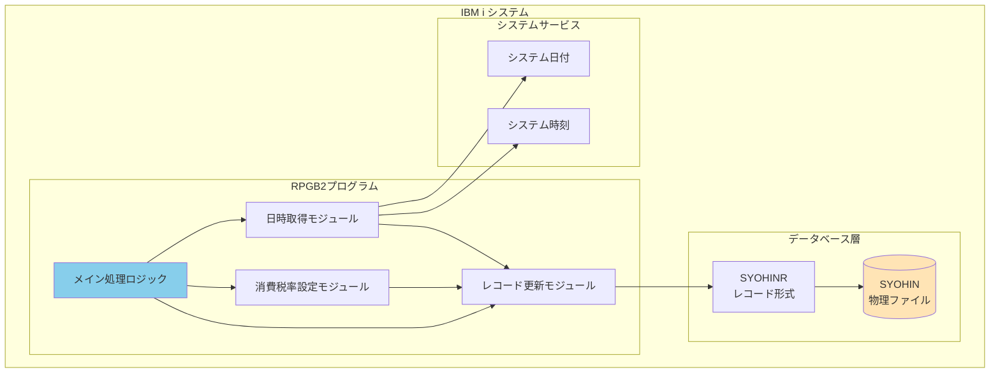

# RPGB2 ER図とフローチャート

## 1. ER図（Entity Relationship Diagram）

### データベース構造

### データ項目詳細

## 2. フローチャート

### 2.1 メイン処理フロー

### 2.2 詳細処理フロー（RPGサイクル含む）

### 2.3 フリーフォーマット版フローチャート

## 3. 処理シーケンス図

## 4. 状態遷移図

## 5. データフロー図

## 6. コンポーネント図

---

## 注記

- **ER図**: SYOHINファイルとSYOHINRレコード形式の関係を示しています
- **フローチャート**: 元のRPGサイクル版とフリーフォーマット版の両方を含みます
- **シーケンス図**: プログラムとファイル、システムとの相互作用を時系列で表現
- **状態遷移図**: プログラムの各状態とその遷移を示します
- **データフロー図**: データの流れと変換処理を視覚化
- **コンポーネント図**: システムの構成要素と依存関係を表現
