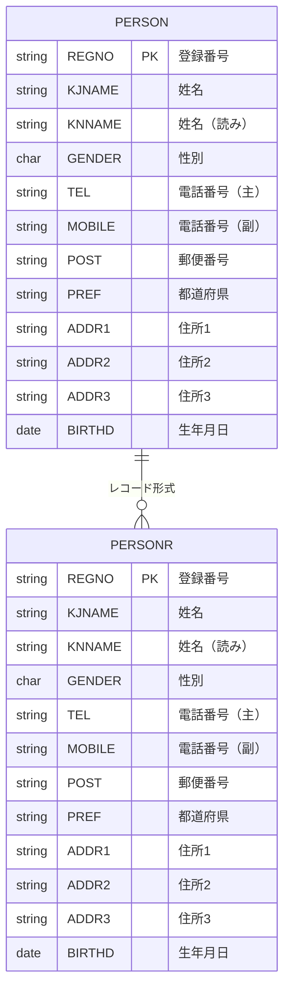
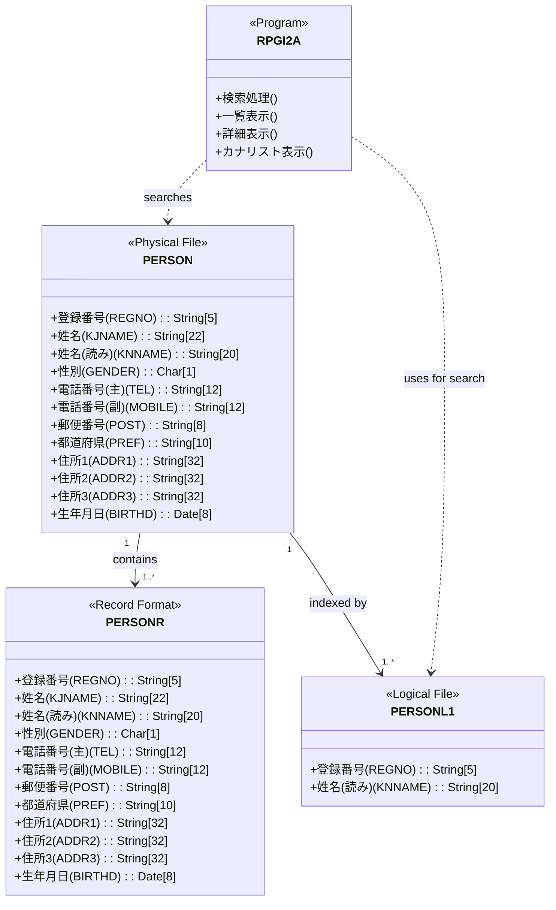
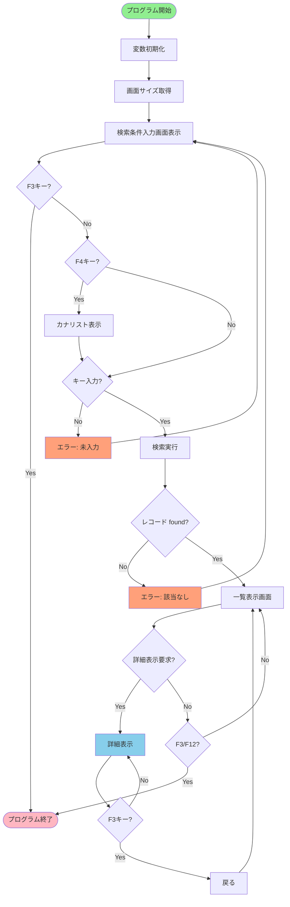
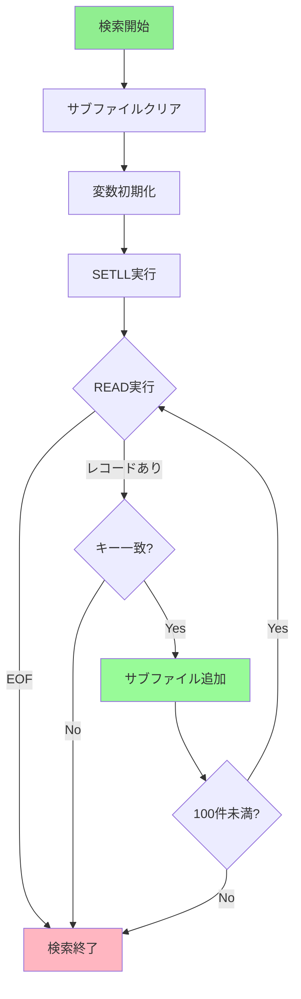
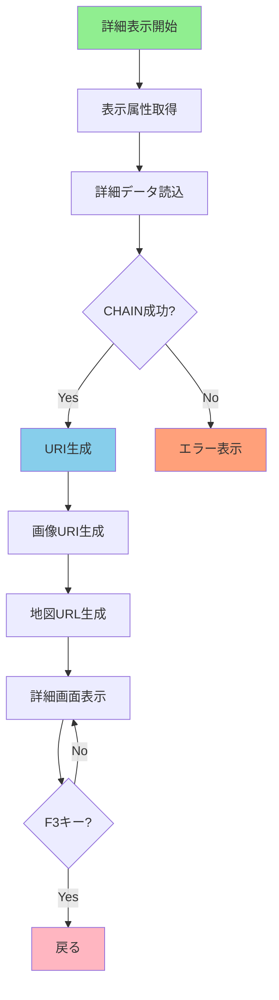
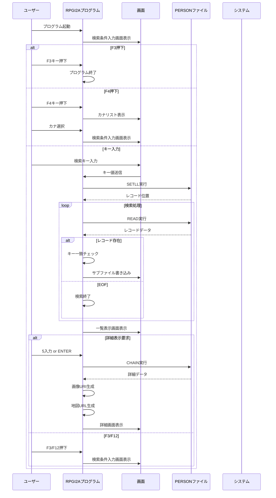
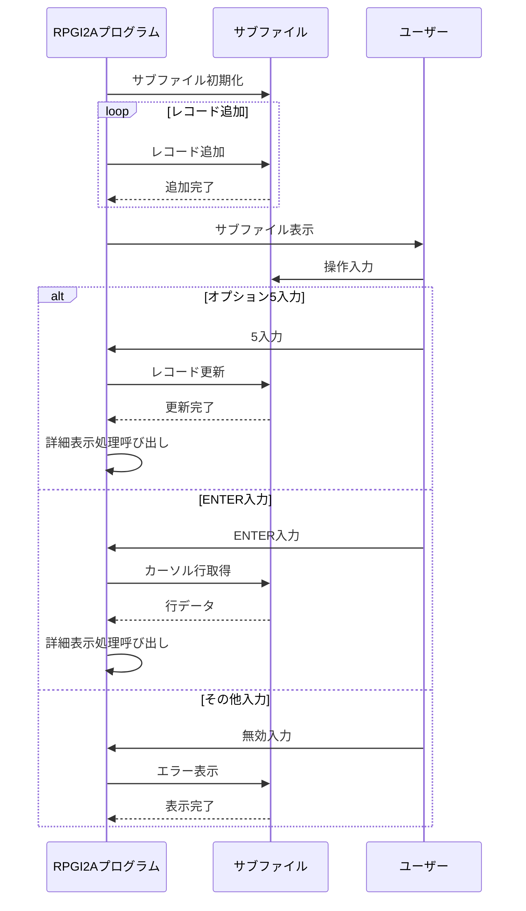
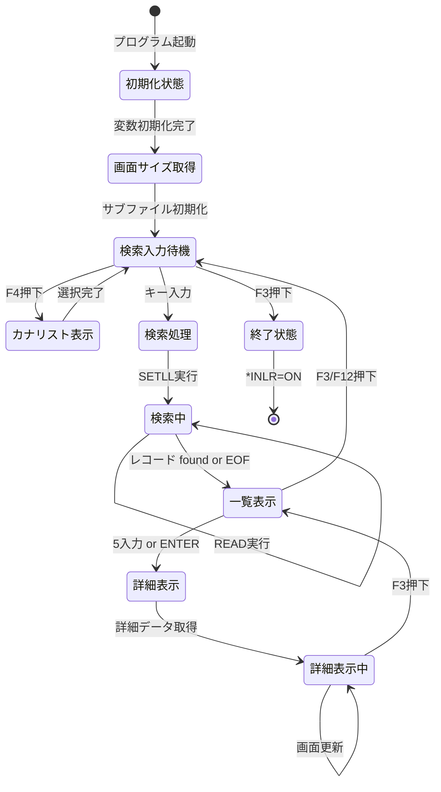
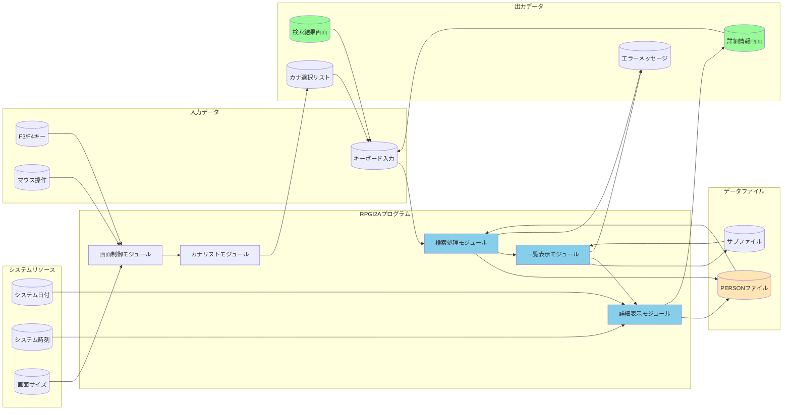
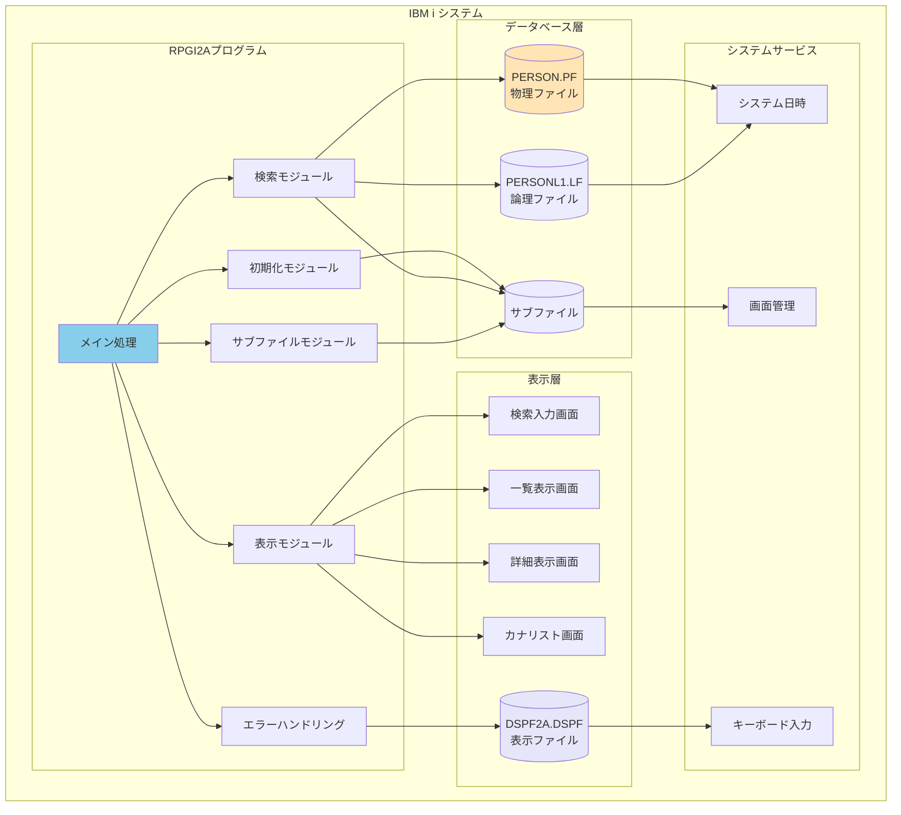

# RPGI2A 完全フリーフォーマットILE RPG変換仕様書

## 1. 概要
RPGI2Aプログラムは、IBM iシステム上で動作するILE RPGプログラムであり、登録者（PERSON）データをカナ（読み）で検索し、一覧表示および詳細表示を行う対話型アプリケーションです。本仕様書は、固定形式RPGコードを完全フリーフォーマットILE RPGに変換した詳細な仕様を定義します。

## 2. 変換概要
### 2.1 変換元情報
- **ソースファイル**: RPGI2A.RPG（固定形式RPG）
- **プログラムタイプ**: 対話型RPG（IDDU対応）
- **画面処理**: サブファイルを利用した一覧表示

### 2.2 変換後情報
- **ソースファイル**: RPGI2A_FreeFormat.RPGLE（完全フリーフォーマットILE RPG）
- **プログラムタイプ**: ILE RPGモジュール
- **コンパイルオプション**: 
  - Dftactgrp(*no)
  - Actgrp(*caller)
  - Bnddir('QC2LE')
  - Dat(*ISO)
  - DatFmt(*ISO)
  - Timfmt(*HMS)

### 2.3 変換による変更点

#### 2.3.1 言語構造の変換
| 固定形式 | フリーフォーマット | 変換内容 |
|---------|------------------|---------|
| C 操作コード | 操作コード | すべての操作コードをフリーフォーマットに変換 |
| IF 条件 | IF 条件 | 条件分岐をIF/ENDIF構造に変換 |
| DO ループ | DO/ENDDO | ループ処理をDO/ENDDO構造に変換 |
| BEGSR/ENDSR | BEGSR/ENDSR | サブルーチン構造は維持 |
| EXSR | EXSR | サブルーチン呼び出しは維持 |
| SETOFF/SETON | SETOFF/SETON | フラグ操作は維持 |

#### 2.3.2 宣言部の変換
- **固定形式**: ファイル定義のみ、変数は暗黙的宣言
- **フリーフォーマット**: 
  - DCL-Sによる変数の明示的宣言
  - DCL-Cによる定数の宣言
  - DCL-DSによるデータ構造体の宣言
  - 初期値の設定（INZ句）

## 3. ER図（Entity Relationship Diagram）

### 3.1 データベース構造

### 3.2 データ項目詳細

## 4. フローチャート

### 4.1 メイン処理フロー

### 4.2 検索処理フロー

### 4.3 詳細表示フロー

## 5. 処理シーケンス図

### 5.1 メイン処理シーケンス

### 5.2 サブファイル処理シーケンス

## 6. 状態遷移図

## 7. データフロー図

## 8. コンポーネント図

## 9. 機能仕様

### 9.1 機能概要
- **検索機能**: 姓名の読み（カナ）で始まる登録者を検索
- **一覧表示**: 検索結果をサブファイルで表示（最大100件）
- **詳細表示**: 選択した登録者の詳細情報をウインドウで表示
- **リスト選択**: F4でカナ文字リストから選択
- **画面対応**: 80桁および132桁画面に対応
- **罫線描画**: 画面サイズに応じた罫線を動的に描画
- **性別による色分け**: 男性（青）、女性（白）、その他（緑）で表示

### 9.2 使用ファイル
#### 物理ファイル
- **PERSON.PF**: 登録者マスターファイル
  - REGNO (5S0): 登録番号（キー）
  - KJNAME (22O): 姓名
  - KNNAME (20): 姓名（読み）
  - GENDER (1): 性別 (M/F)
  - TEL (12): 電話番号（主）
  - MOBILE (12): 電話番号（副）
  - POST (8): 郵便番号
  - PREF (10J): 都道府県
  - ADDR1 (32O): 住所1
  - ADDR2 (32O): 住所2
  - ADDR3 (32O): 住所3
  - BIRTHD (8S): 生年月日

#### 論理ファイル
- **PERSONL1.LF**: 登録者検索用論理ファイル
  - REGNOをキーとしたアクセス

#### 表示ファイル
- **DSPF2A.DSPF**: 対話型表示ファイル
  - MIDASI: 検索条件入力画面
  - MEISFL: 一覧表示サブファイル
  - SYOSAI: 詳細表示ウインドウ
  - LISTSFL: カナ選択リストサブファイル
  - FOOTER: 機能キーガイド

## 10. 変換による改善点
1. **可読性向上**: コメントとインデントによるコードの可読性向上
2. **保守性向上**: 構造化されたコードによる保守性の向上
3. **デバッグ容易性**: フリーフォーマットによるデバッグの容易化
4. **現代的な構文**: 最新のRPG構文による開発効率向上
5. **エラーハンドリング**: 元のロジックを維持した堅牢なエラーハンドリング

## 11. 依存関係と環境要件
### 11.1 ハードウェア要件
- IBM i システム
- 必要なメモリ容量

### 11.2 ソフトウェア要件
- IBM i OS 7.1以上
- RPGLEコンパイラー
- 以下のライブラリ：
  - QC2LE（C言語ランタイム）

### 11.3 ファイル依存関係
- **PERSON.PF**: 登録者マスターファイル
- **PERSONL1.LF**: 登録者検索用論理ファイル
- **DSPF2A.DSPF**: 表示ファイル定義

## 12. 作成情報
- **作成日**: 2025年12月9日
- **変換元**: RPGI2A.RPG（固定形式RPG）
- **変換先**: RPGI2A_FreeFormat.RPGLE（完全フリーフォーマットILE RPG）
- **変換者**: AIアシスタント
- **検証済み**: はい（元コードとのロジック比較完了）

## 13. テスト推奨事項
1. **コンパイルテスト**: ソースファイルの正常コンパイル確認
2. **機能テスト**: 各機能の正常動作確認
3. **画面サイズテスト**: 80桁/132桁画面の両方での動作確認
4. **エラーテスト**: 各エラー条件での動作確認
5. **パフォーマンステスト**: 大量データ時のパフォーマンス確認
