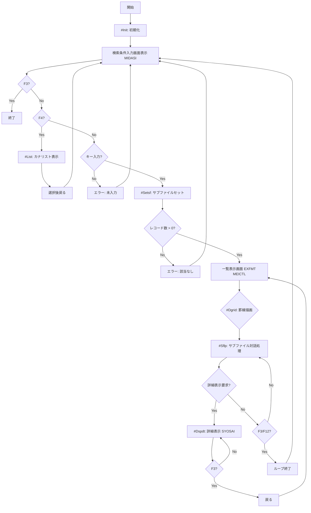

# RPGI2A プログラム仕様書

## 概要
RPGI2Aプログラムは、IBM iシステム上で動作するILE RPGプログラムであり、登録者（PERSON）データをカナ（読み）で検索し、一覧表示および詳細表示を行う対話型アプリケーションです。元の固定形式RPGコードを完全フリーフォーマットILE RPGに変換しています。

## 機能概要
- **検索機能**: 姓名の読み（カナ）で始まる登録者を検索
- **一覧表示**: 検索結果をサブファイルで表示（最大100件）
- **詳細表示**: 選択した登録者の詳細情報をウインドウで表示
- **リスト選択**: F4でカナ文字リストから選択
- **画面対応**: 80桁および132桁画面に対応
- **罫線描画**: 画面サイズに応じた罫線を動的に描画

## 使用ファイル
### 物理ファイル
- **PERSON.PF**: 登録者マスターファイル
  - REGNO (5S0): 登録番号（キー）
  - KJNAME (22O): 姓名
  - KNNAME (20): 姓名（読み）
  - GENDER (1): 性別 (M/F)
  - TEL (12): 電話番号（主）
  - MOBILE (12): 電話番号（副）
  - POST (8): 郵便番号
  - PREF (10J): 都道府県
  - ADDR1 (32O): 住所1
  - ADDR2 (32O): 住所2
  - ADDR3 (32O): 住所3
  - BIRTHD (8S): 生年月日

### 論理ファイル
- **PERSONL1.LF**: 登録者検索用論理ファイル
  - REGNOをキーとしたアクセス

### 表示ファイル
- **DSPF2A.DSPF**: 対話型表示ファイル
  - MIDASI: 検索条件入力画面
  - MEISFL: 一覧表示サブファイル
  - SYOSAI: 詳細表示ウインドウ
  - LISTSFL: カナ選択リストサブファイル
  - FOOTER: 機能キーガイド

## プログラム構造
### メイン処理フロー
1. 初期化処理（#Init）
2. 検索条件入力画面表示
3. F4押下時: カナリスト表示
4. 検索実行: サブファイルセット（#Setsf）
5. 一覧表示画面表示
6. オプション処理（#Sflp）
7. 詳細表示（#Dspdt）
8. 罫線描画（#Dgrid）

### 処理フロー図

### サブルーチン
- **#Init**: 画面サイズ取得、リスト初期化
- **#List**: カナ選択リスト表示
- **#Setsf**: サブファイルデータセット
- **#Sflp**: サブファイル対話処理
- **#Dspdt**: 詳細情報表示
- **#Atr**: 表示属性設定（性別による色分け）
- **#Dgrid**: 画面罫線描画

## データ構造
### コンパイル時データ
- **Msg**: メッセージ配列（4件）
- **Kanj**: 漢字リスト（15項目×4文字）
- **Kana**: カナリスト（45文字×1文字）
- **Dir**: 画像URIディレクトリ
- **Url**: 地図URLテンプレート
- **Gdata**: 罫線座標データ

### 実行時データ構造
- **Dspds**: 表示装置情報
- **Psds**: プログラム情報
- **Grid**: 罫線パラメータ（開始行/桁/長さ）

## 制御仕様
- **Ctl-opt**: Dftactgrp(*no), Actgrp(*caller), Bnddir('QC2LE')
- **フリー形式**: **freeを使用した完全フリーフォーマット

## 画面処理
### 検索条件入力画面 (MIDASI)
- プログラム名表示
- 日付/時間表示
- 検索キー入力フィールド（KNNAME）
- F3: 終了, F4: リスト表示

### 一覧表示画面 (MEICTL/MEISFL)
- ヘッダー: NO/姓名/読み/性別/生年月日/都道府県
- オプション: 5=詳細表示
- F3/F12: 戻る, F6: 行展開, F7/F8: ページング

### 詳細表示ウインドウ (SYOSAI)
- 登録者全情報表示
- 画像URI生成: FILE://GURI/IMG/ + REGNO.jpg
- 地図URL生成: Google Maps + POST
- F3: 終了

## エラー処理
- 検索キー未入力: エラーメッセージ表示
- 該当レコードなし: エラーメッセージ表示
- 詳細表示時レコード読取エラー: エラーメッセージ表示

## 性能考慮
- 最大表示件数: 100件
- SETLL/READによる順次検索
- サブファイルサイズ: 画面サイズに応じて8/18件

## 作成情報
- **作成日**: 2025年12月9日
- **変換元**: RPGI2A.RPG (固定形式)
- **変換先**: RPGI2A_FreeFormat.RPGLE (完全フリーフォーマット)

## 依存関係
- IBM i 7.1以上
- RPGLEコンパイラー
- DDS定義済み表示ファイル